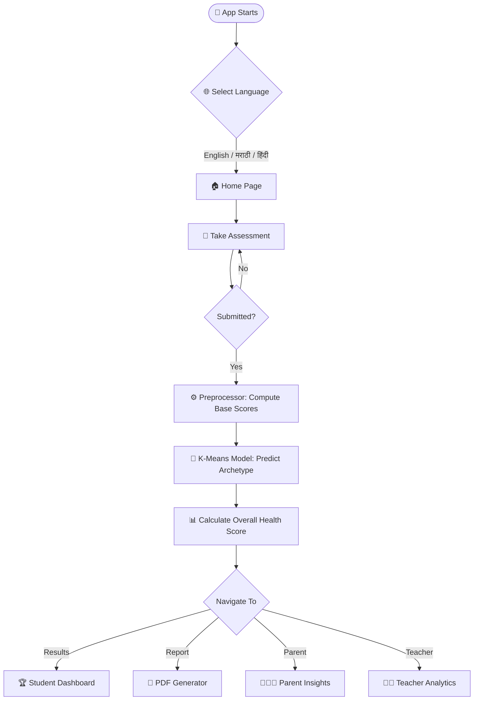
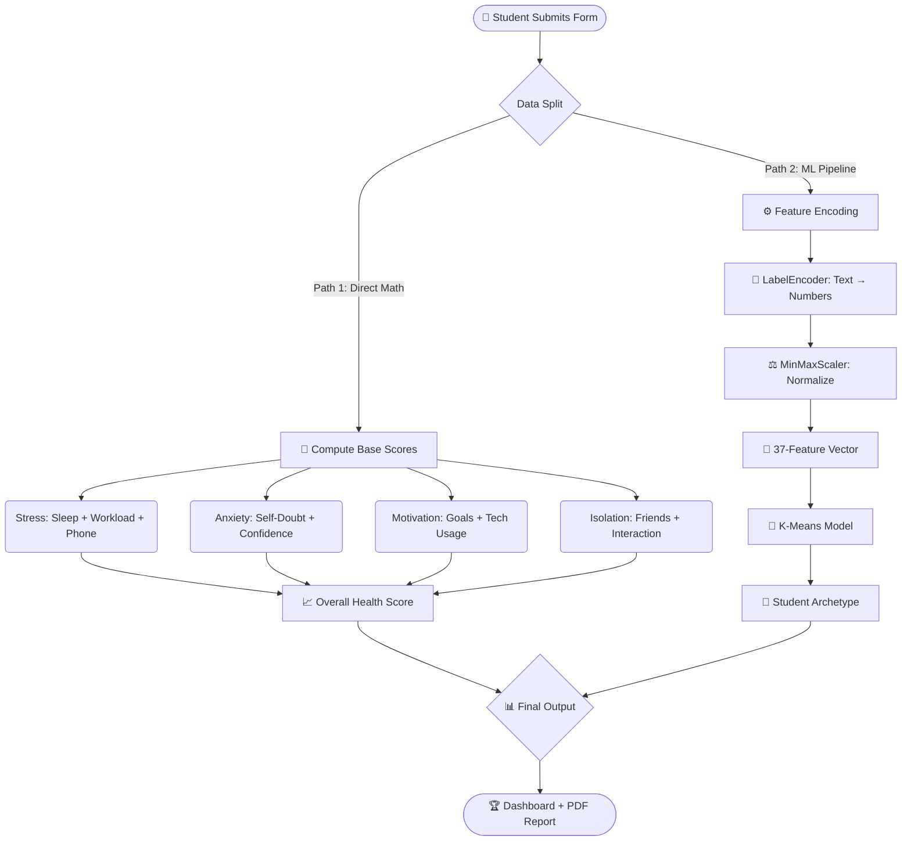

<div align="center">

# 🧠 MindMap
### *AI-Powered Student Psychological Health Assessment*


<br/>


<br/><br/>

> **MindMap** is an AI-powered web app that evaluates the **psychological health of students** using Machine Learning.  
> It assesses **stress, anxiety, motivation, and social isolation** — then delivers actionable insights for Students, Parents & Teachers.

<br/>


</div>

---

## 📚 Table of Contents

| # | Section |
|---|---------|
| 1 | [🤔 What is MindMap?](#-what-is-mindmap) |
| 2 | [🎯 Use Cases](#-use-cases) |
| 3 | [✨ Key Features](#-key-features) |
| 4 | [🧠 ML Algorithms Used](#-ml-algorithms-used) |
| 5 | [🏗️ Project Architecture](#️-project-architecture) |
| 6 | [🔄 App Flowcharts](#-app-flowcharts) |
| 7 | [📸 Screenshots](#-screenshots) |
| 8 | [📈 Using the Dashboards](#-using-the-dashboards) |
| 9 | [🛠️ Tech Stack](#️-tech-stack) |
| 10 | [🚀 Getting Started](#-getting-started) |
| 11 | [📁 Project Structure](#-project-structure) |
| 12 | [👥 Contributors](#-project-contributors) |

---

## 🤔 What is MindMap?

College life can be overwhelming. Students face **anxiety, academic pressure, and social isolation** — often silently.

**MindMap** is an early-screening AI tool that detects these issues before they escalate.

Instead of a boring survey form, it works like an intelligent assistant:

```
📝 Student answers simple questions about sleep, study habits, and mood
        ↓
🤖 MindMap processes the data using Machine Learning (K-Means + XGBoost)
        ↓
📊 Instantly generates Stress, Anxiety, Motivation & Overall Health scores
        ↓
📄 Generates a downloadable PDF report with actionable recommendations
```

🌍 Supports **English**, **मराठी (Marathi)**, and **हिंदी (Hindi)** — making it accessible to rural and regional students!

---

## 🎯 Use Cases

| 👤 Who | 🎯 How They Use It |
|--------|-------------------|
| 🏫 **Schools & Colleges** | Monitor mental health across a class; identify At-Risk students for counseling |
| 👨‍👩‍👧 **Parents** | Understand if screen time, poor sleep, or anxiety is affecting their child's grades |
| 👩‍⚕️ **Student Counselors** | Use as a pre-therapy screening tool to save time and get immediate insights |
| 🧠 **Students (Self-Assessment)** | Understand their own "Archetype" and get automated, personalized suggestions |

---

## ✨ Key Features

### 🌍 1. Multilingual Interface
Switch seamlessly between **English**, **मराठी**, and **हिंदी**.  
All questions, results, and PDF reports are fully translated — no language barrier!

### 🤖 2. Machine Learning Driven Scoring
- Uses **K-Means Clustering** to classify students into Psychological Archetypes (e.g., *Balanced*, *Stressed*, *At-Risk*)
- Pre-trained models load instantly — no waiting!

### 📊 3. Three Dynamic Dashboards
- **🎓 Student View** — Colorful gauges & charts: Stress, Anxiety, Motivation, Overall Health
- **👨‍👩‍👧 Parent View** — Simple, jargon-free advice on how to support their child
- **👨‍🏫 Teacher View** — Class-level trends and individual Academic Risk Flags

### 📄 4. Downloadable PDF Report
- Auto-generated, beautifully formatted PDF with charts, scores, and personalized advice
- Printer-friendly and shareable — zero manual effort!

### 🔒 5. Privacy First
- No data is stored externally
- All processing happens locally on the machine running the app

---

## 🧠 ML Algorithms Used

MindMap is **not** just a web form. It uses real Machine Learning:

### 1️⃣ K-Means Clustering (Unsupervised Learning)
- Groups students into behavioral clusters (Archetypes) based on 37 features
- Students with similar patterns (e.g., low sleep + high phone usage) are grouped together
- Used in: `utils/preprocessor.py` → `models/kmeans_archetype.pkl`

### 2️⃣ Label Encoding + Min-Max Scaling (Data Preparation)
- Text answers like `"Often"` or `"Never"` → encoded to numbers via `LabelEncoder`
- All values normalized to a uniform 0–1 range using `MinMaxScaler`
- Ensures consistent, bias-free input for the ML models

### 3️⃣ Mathematical Score Aggregation
Combines weighted data points into human-readable metrics:
```
Stress Index    = f(Sleep Hours, Workload, Phone Hours)
Anxiety Level   = f(Self-Doubt Score, Exam Confidence, Sleep Quality)
Motivation Score = f(Goal Clarity, Tech Usage, Study Habit)
Social Isolation = f(Friend Count, Social Interaction Frequency)
Overall Health  = weighted_average(Stress, Anxiety, Motivation, Isolation)
```

---

## 🏗️ Project Architecture


### High-Level System Design

```
┌─────────────────────────────────────────────────────────┐
│                     STREAMLIT FRONTEND                  │
│   (Browser UI · Forms · Charts · PDF Download Button)   │
└──────────────────────────┬──────────────────────────────┘
                           │ User Inputs
┌──────────────────────────▼──────────────────────────────┐
│               BACKEND LOGIC (Python / Streamlit)        │
│         (Session State · Routing · Page Modules)        │
└──────┬────────────────────────────────────────┬─────────┘
       │                                        │
┌──────▼──────────┐                   ┌─────────▼────────┐
│  DATA PROCESSOR  │                   │   REPORT SERVICE  │
│ preprocessor.py  │                   │  (fpdf2 + charts) │
│ ─────────────── │                   │ ───────────────── │
│ • Label Encoding │                   │ • Auto-layout PDF │
│ • Min-Max Scale  │                   │ • Unicode Support │
│ • Score Calc     │                   │ • Chart Embed     │
└──────┬──────────┘                   └──────────────────┘
       │
┌──────▼──────────┐
│   ML MODELS      │
│  (models/*.pkl)  │
│ ─────────────── │
│ • K-Means        │
│ • Archetype Tag  │
│ • Risk Flag      │
└──────────────────┘
```

---

## 🔄 App Flowcharts

### 1. Overall App Flow



### 2. ML Data Pipeline



---

## 📸 Screenshots

**🏠 Home Dashboard**


**📝 Assessment Form**


**🏆 Student Results Dashboard**


**📄 Example PDF Report**  
👉 [Download Example PDF Report](./example_report.pdf)

---

## 📈 Using the Dashboards

### 🎓 For Students
1. Go to the **Assessment** tab
2. Answer all questions honestly (takes ~3 minutes)
3. Head to **Results** to view your scores and Archetype
4. Click **Report** to download your personalized PDF

### 👨‍👩‍👧 For Parents
1. Go to the **Parent** tab
2. View simple, actionable advice (no charts or jargon!)
3. Understand what is affecting your child and *what to do next*

### 👨‍🏫 For Teachers
1. Go to the **Teacher** tab
2. View class-level mental health trends
3. Identify students with an **🚨 Academic Risk Flag**

---

## 🛠️ Tech Stack

| Category | Technology |
|----------|-----------|
| **Web Framework** | [Streamlit](https://streamlit.io/) 1.32+ |
| **Machine Learning** | scikit-learn (K-Means, Scaler, LabelEncoder), XGBoost |
| **Data** | pandas, numpy |
| **Visualization** | plotly, matplotlib, seaborn |
| **PDF Generation** | fpdf2 |
| **Model Persistence** | joblib |
| **Language** | Python 3.8+ |

---

## 🚀 Getting Started

### Prerequisites
- Python **3.8 or higher** installed on your machine

### Option A — Download ZIP (Easiest)
1. Click the green **`Code`** button on this page
2. Select **`Download ZIP`**
3. Extract the ZIP to a folder

### Option B — Git Clone
```bash
git clone https://github.com/Tejas-952007/MindMap.git
cd MindMap
```

### Step 1 — Install Requirements
```bash
pip install -r requirements.txt
```

### Step 2 — Generate Data & Train Models
> ⚠️ **Do this only once** on first run!
```bash
python generate_data_and_train.py
```

### Step 3 — Launch the App 🎉
```bash
streamlit run app.py
```
> The app opens automatically at **`http://localhost:8501`**

---

## 📁 Project Structure

```
MindMap/
│
├── 📄 app.py                        # Main Streamlit app — routing & sidebar
├── 📄 generate_data_and_train.py    # Generates dummy data & trains ML models
├── 📄 requirements.txt              # All Python dependencies
├── 📄 example_report.pdf            # Sample generated PDF report
│
├── 📂 page_modules/                 # Individual page logic
│   ├── page_01_information.py       # Home / Info page
│   ├── page_02_global_context.py    # Global mental health context
│   ├── page_03_assessment.py        # Student questionnaire form
│   ├── page_04_results.py           # Results & score dashboard
│   ├── page_05_report.py            # PDF report generator
│   ├── page_06_parent_view.py       # Parent insights page
│   └── page_07_teacher_view.py      # Teacher analytics page
│
├── 📂 utils/                        # Helper utilities
│   ├── preprocessor.py              # Data processing & ML scoring engine
│   └── translations.py              # English / मराठी / हिंदी translations
│
├── 📂 models/                       # Pre-trained ML model files (.pkl)
│   └── kmeans_archetype.pkl         # K-Means clustering model
│
├── 📂 data/                         # Generated training dataset (CSV)
│
└── 📂 assets/                       # UI assets
    ├── style.css                    # Custom Streamlit CSS theme
    ├── home.png                     # Screenshot — Home page
    ├── assessment.png               # Screenshot — Assessment form
    ├── results.png                  # Screenshot — Results dashboard
    └── architecture.png             # System architecture diagram
```

---

## 👥 Project Contributors

- **Tejas** ([@Tejas-952007](https://github.com/Tejas-952007)) - Lead Developer
- **Snehal** ([@snehal-p10](https://github.com/snehal-p10)) - Contributor

---

<div align="center">

## 🤝 Contributing

Pull requests are welcome! For major changes, please open an issue first.  
If this project helped you, please ⭐ **star the repo** — it means a lot!

---

**⚠️ Disclaimer**  
MindMap is an **educational screening tool**, *not a clinical diagnostic device*.  
It provides insights to help students, parents, and teachers take timely action.  
Severe cases should always consult qualified mental health professionals.

---

Made with ❤️ by **[Tejas](https://github.com/Tejas-952007)** | Pune, Maharashtra 🇮🇳

</div>
