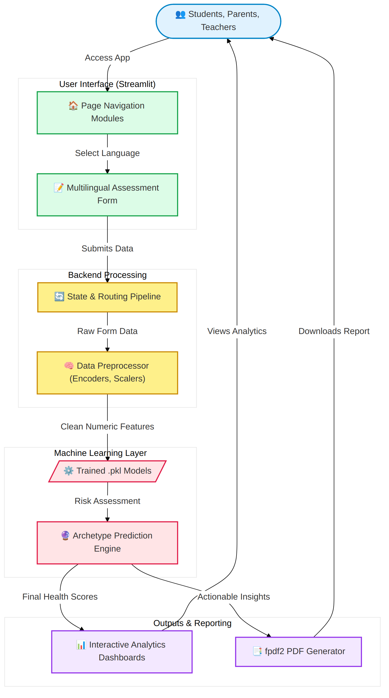
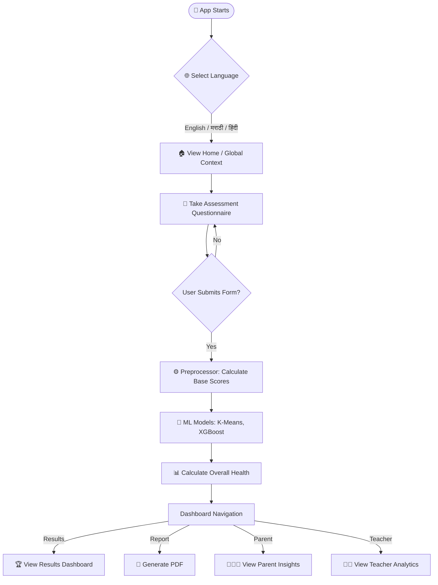
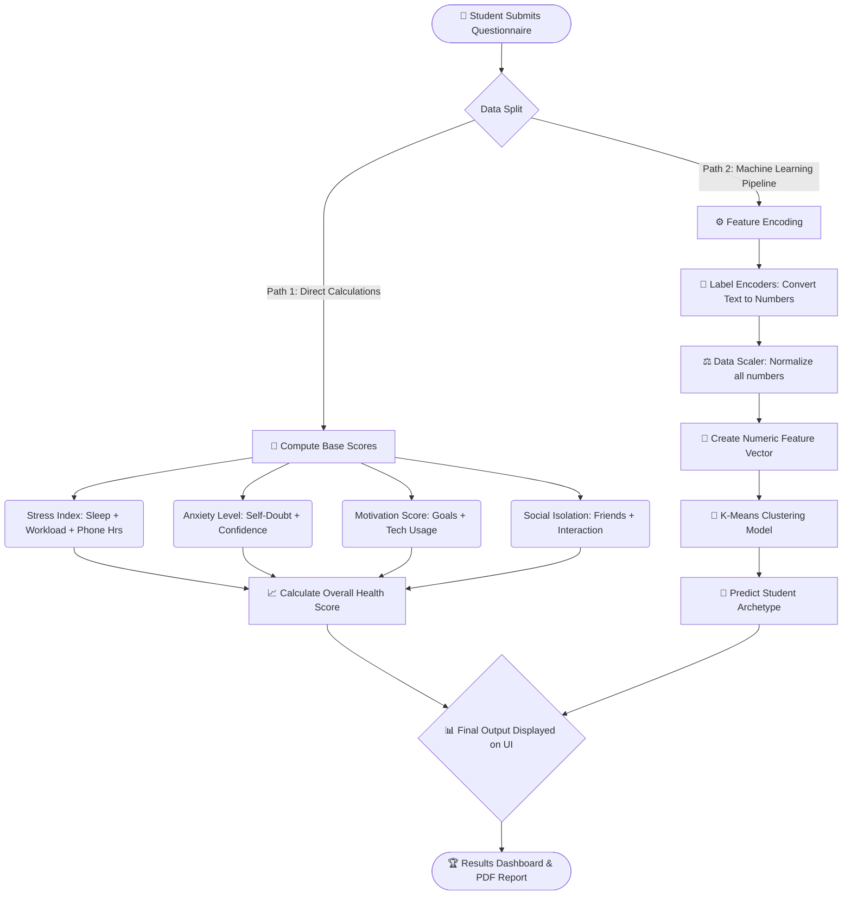
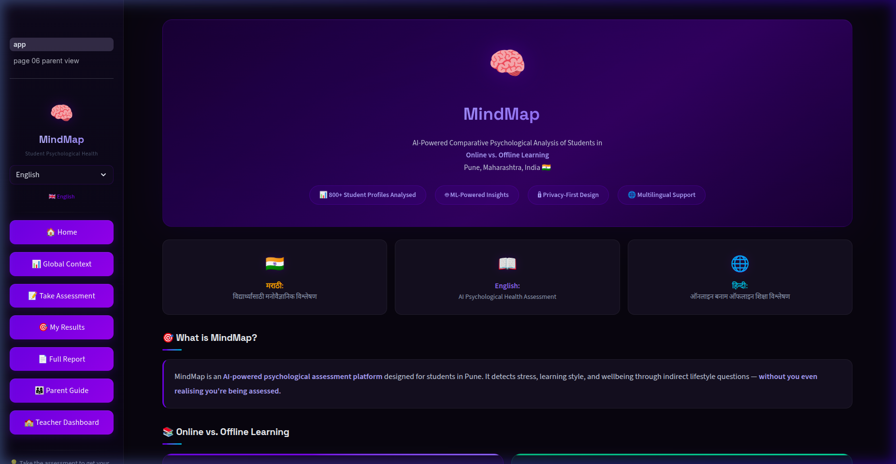
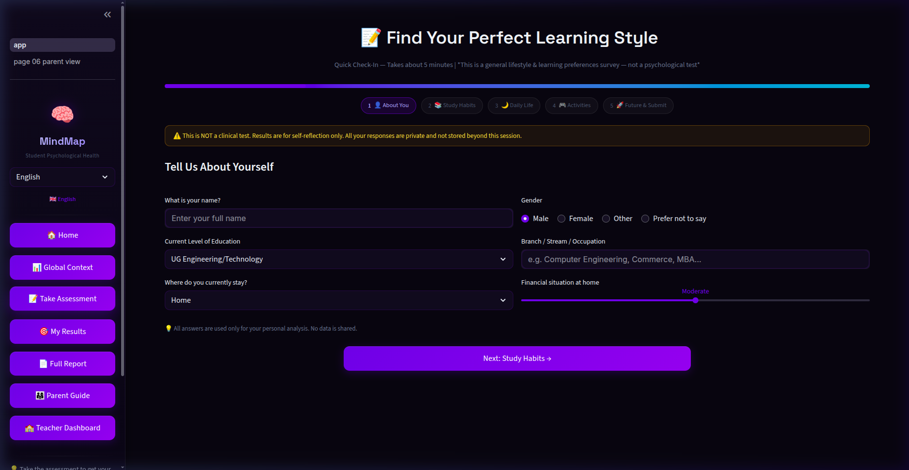
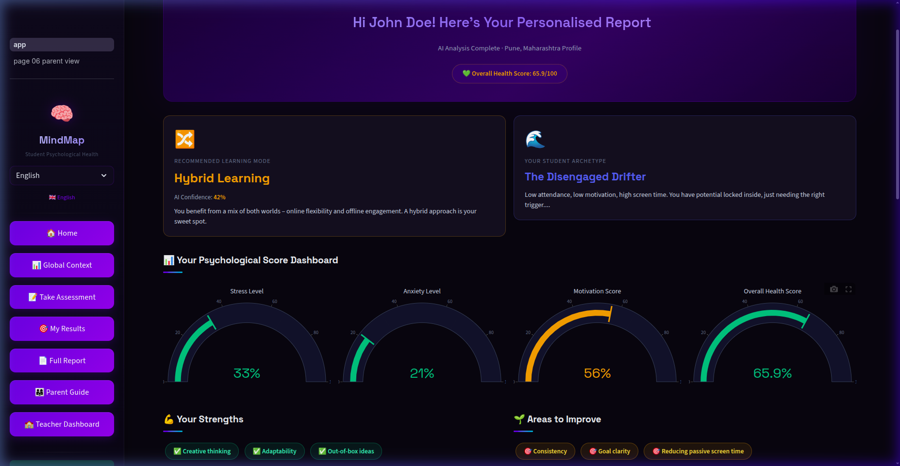

# 🧠 MindMap / Student Psychological Health Assessment

MindMap is an **AI-powered web application** designed to evaluate and understand the psychological health of students. Built using Streamlit and Machine Learning, it assesses student stress, anxiety, and motivation based on their daily routines and behaviors, and provides intelligent insights.

---

## 📚 Table of Contents
1. [What is MindMap?](#-what-is-mindmap)
2. [Where can this be used? (Use Cases)](#-where-can-this-be-used-use-cases)
3. [What are its benefits?](#-what-are-its-benefits)
4. [What's New — Key Features](#-whats-new--key-features)
5. [Project Architecture](#%EF%B8%8F-project-architecture)
6. [How the App Works — Flowcharts](#-how-the-app-works--flowcharts)
7. [Screenshots & Example PDF](#-screenshots--example-pdf-report)
8. [What Algorithms Does it Use?](#-what-algorithms-does-it-use)
8. [Using the Dashboards](#-using-the-dashboards)
9. [Tech Stack](#%EF%B8%8F-tech-stack)
10. [Getting Started (Beginner Friendly)](#-getting-started-beginner-friendly)
11. [Project File Structure](#-project-file-structure)

---

## 🤔 What is MindMap?
College life can be tough. Students often face anxiety, academic pressure, and social isolation. **MindMap** is an initial screening tool that helps identify these issues early.

Instead of a boring form, it acts as an intelligent assistant:
> 📝 *Student answers simple questions about sleep, study habits, and mood.*  
> 🤖 *MindMap processes this using Machine Learning.*  
> 📊 *It instantly generates scores for Stress, Anxiety, Motivation, and Overall Health.*

It runs beautifully in your browser and supports **English, Marathi, and Hindi**, making it accessible to a wider audience!

---

## 🎯 Where can this be used? (Use Cases)
हा प्रोजेक्ट कुठे आणि कोण वापरू शकतं?

1. **🏫 Schools and Colleges:**
   - To monitor the overall mental health of students in a class or college without making them feel uncomfortable.
   - Teachers can identify students who are "At-Risk" due to high academic stress or social isolation and provide counseling.
2. **👨‍👩‍👧 Parents at Home:**
   - Instead of asking, "Why are your marks low?" parents can use this to understand if screen time, poor sleep, or anxiety is the real issue.
3. **👩‍⚕️ Student Counselors:**
   - As an initial survey tool before actual therapy sessions to save time and immediately understand what's troubling the student.
4. **🧠 Self-Assessment for Students:**
   - Whenever a student feels lost or unmotivated, they can take this test to see their personal "Archetype" and get automated actionable suggestions.

---

## 💡 What are its benefits? (फायदे)

- **Early Detection of Problems:** Identify issues like depression, isolation, or high exam anxiety before they cause academic failure or serious mental health crises.
- **Data-Driven (Not Guesswork):** Uses real Data Science and ML to connect sleep habits, phone usage, and grades, giving a clear picture (e.g. "Low sleep + 5hrs phone = High Anxiety").
- **Language is no Barrier:** Because it supports Hindi and Marathi, students from rural areas (ग्रामीण भाग) or regional schools can answer honestly without worrying about English fluency.
- **Privacy First, Actionable Output:** Generates reports that don't just dump numbers, but actually tell parents and teachers *what to do next*.

---

## ✨ What's New — Key Features

1. **🌍 Multilingual Interface**
   - Seamlessly switch between **English**, **मराठी (Marathi)**, and **हिंदी (Hindi)**.
   - All questions, reports, and insights are fully translated.

2. **🤖 Machine Learning Driven Scoring**
   - Uses pre-trained algorithms (K-Means, XGBoost) to predict psychological patterns.
   - Groups students into "Archetypes" (e.g., Stressed, Balanced).

3. **📊 Dynamic Result Dashboards**
   - **Student View:** Colorful gauges and charts showing personal health scores.
   - **Parent View:** Easy-to-understand actionable advice without confusing data.
   - **Teacher View:** Class-level trends and academic risk flagging.

4. **📄 PDF Report Generation**
   - Downloadable, printer-friendly PDF reports containing charts and detailed analysis.

---

## 🏗️ Project Architecture

*(You can replace the placeholder below with your actual architecture diagram image once you have it)*



### High-Level System Design
MindMap follows a stateless, simple, yet powerful architecture:
1. **Frontend (Streamlit UI):** Users access the app directly via the browser. Forms and dashboards are dynamically generated here.
2. **Backend Logic:** Also managed by Python via Streamlit. Handles routing and session state.
3. **Data Preprocessor (`utils/preprocessor.py`):** Takes raw form inputs and transforms them into scaled feature vectors.
4. **Machine Learning Models (`models/*.pkl`):** Pre-trained models are loaded into memory to instantly predict student archetypes and warning flags.
5. **Report Service:** Uses `fpdf2` to construct a dynamic, heavily customized PDF with Unicode support and automated layout.

---

## 🔄 How the App Works — Flowcharts

### 1. Overall App Flow


### 2. Data Processing & Machine Learning Flow (`preprocessor.py`)
This chart explains step-by-step how user answers are converted into the final scores and ML predictions.



---

## 📸 Screenshots & Example PDF Report

- **Example PDF Report:** A sample of the generated PDF report is included in this repository. You can view exactly what the final output looks like here: 👉 [Download Example PDF Report](./example_report.pdf)

**1. Home Dashboard**


**2. Assessment Form**


**3. Student Results Dashboard**
 

---

## 🧠 What Algorithms Does it Use?

MindMap is not just a standard web form; it uses **Machine Learning** algorithms to understand and predict student behaviors. 

1. **K-Means Clustering (Unsupervised Learning):**
   - **Why we used it:** To group students into clusters (Archetypes) based on similarities in their behavior (e.g., students who sleep less and use phones more are grouped together). 
   - **How it works:** Taking a 37-feature data vector derived from the questionnaire, K-Means groups the student into one of several predefined clusters. If they match a cluster associated with high stress and low motivation, they are flagged as "At-Risk."
   - **Where in code:** Used in `utils/preprocessor.py` via a pre-trained `kmeans_archetype.pkl` model.

2. **Mathematical Normalization and Aggregation (Calculus):**
   - **Action:** Combines data points using specific weights to formulate human-readable metrics.
   - **Example:** `Anxiety Level` = (Self-Doubt Value + Exam Blanking Frequency + Lack of Sleep).
   
3. **Label Encoding and Min-Max Scaling (Data Preparation):**
   - Before any algorithm can predict, text answers (like "Often" or "Never") are encoded into numbers using Scikit-Learn's `LabelEncoder`, and then scaled to a uniform range using `MinMaxScaler`.

---

## 📈 Using the Dashboards

### For Students
- Go to the **Assessment** tab and honestly answer the questions.
- Once submitted, head to **Results** to see your "Overall Health Score", "Anxiety Level", and "Stress Index".
- Click **Report** to download your personalized PDF.

### For Parents
- Go to the **Parent** tab.
- Here, you won't see complicated charts. Instead, you'll see simple, actionable advice on how to support your child based on their recent assessment.

### For Teachers
- Go to the **Teacher** tab.
- Teachers can see aggregated data (trends) and identify if a student has an **"Academic Risk Flag"** indicating they might need extra attention.

---

## 🛠️ Tech Stack

- **Frontend Framework:** [Streamlit](https://streamlit.io/)
- **Data Manipulation:** `pandas`, `numpy`
- **Machine Learning:** `scikit-learn` (K-Means, Scalers, Label Encoders), `xgboost`
- **Data Visualization:** `plotly`, `matplotlib`, `seaborn`
- **Tools:** `fpdf2` (for PDF generation), `joblib` (for loading models).

---

## 🚀 Getting Started (Beginner Friendly)

### Step 1 — You need:
- A computer with **Python** installed (Python 3.8 or higher is recommended).

### Step 2 — Download the project
**Option A — Download ZIP (easiest):**
1. Go to: [MindMap GitHub Repo](https://github.com/Tejas-952007/MindMap)
2. Click the green **"Code"** button
3. Click **"Download ZIP"**
4. Unzip the downloaded file

**Option B — Git clone:**
```bash
git clone https://github.com/Tejas-952007/MindMap.git
cd MindMap
```

### Step 3 — Install Requirements
Open your terminal (or Command Prompt) inside the folder and run:
```bash
pip install -r requirements.txt
```

### Step 4 — Run the App!
If you are running this for the very first time, generate the data and train the models:
```bash
python generate_data_and_train.py
```

Then, start the web app:
```bash
streamlit run app.py
```
> The app will automatically open in your browser at `http://localhost:8501`.

---

## 📁 Project File Structure

Here is what each file and folder does:

| Folder / File | What it does |
|--------------|--------------|
| `app.py` | The main file that runs the Streamlit application and sidebar navigation. |
| `page_modules/` | Contains the code for different pages (Home, Assessment, Results, Parent View, etc.). |
| `models/` | Stores the trained Machine Learning models (`.pkl` files) generated by Python. |
| `utils/` | Helper files, like `preprocessor.py` for data calculations and translations. |
| `data/` | Where generated dummy dataset files are stored. |
| `assets/` | Stores the CSS styling files (colors, layout) and images. |
| `generate_data_and_train.py` | The script that generates dummy data and trains the ML models before you start the app. |
| `requirements.txt` | The list of all Python packages needed to run this project. |

---

**Disclaimer:** MindMap is an educational screening tool and *not a clinical diagnostic device*. It provides insights to help students, parents, and teachers take timely actions. Severe cases should always consult mental health professionals.
